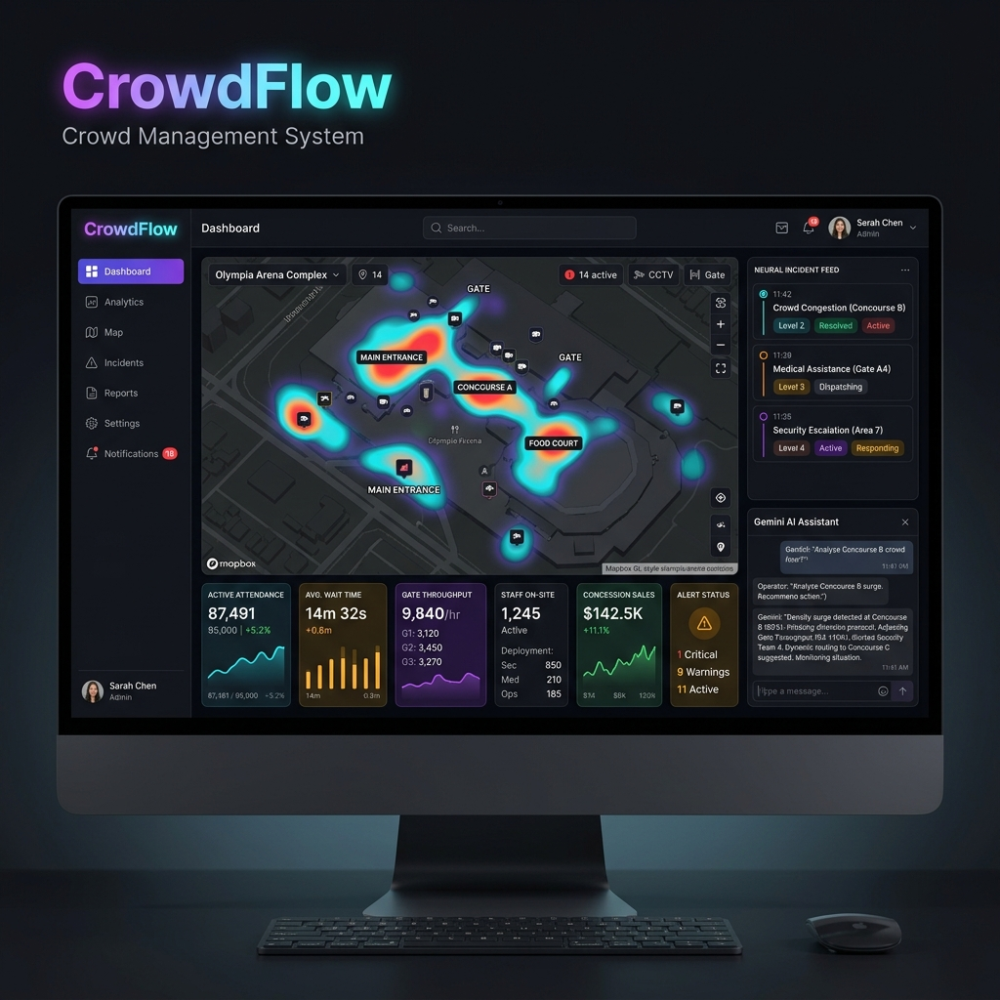
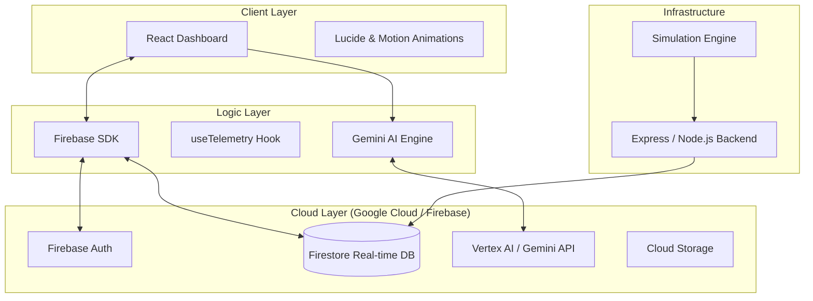

# CrowdFlow AI: Intelligent Venue Command Center



> **CrowdFlow** is an AI-powered venue command center that combines real-time crowd telemetry, emergency decision support, smart staff coordination, and congestion-aware response workflows for safer large-scale events.

---

## 🏟️ The Problem
Managing large crowds at stadiums or arenas is inherently chaotic. Standard operations rely on fragmented radio chatter, delayed CCTV reviews, and manual staff dispatch. When an incident occurs, response times are slowed by a lack of shared situational awareness, specifically:
- **Blind Spots**: Difficulty tracking real-time density across vast concourses.
- **Latency**: Critical data (congestion, emergencies) takes minutes to reach decision-makers.
- **Decision Fatigue**: Shift commanders must process hundreds of data points simultaneously during high-stress moments.

## 🚀 The Solution: CrowdFlow AI
CrowdFlow bridge the gap between "raw sensor data" and "actionable intelligence." By fusing **Gemini AI** with real-time **Firestore** telemetry, we provide:
- **Predictive Heatmapping**: Live spatial intelligence with automated congestion risk detection.
- **Neural Incident Feed**: An AI-augmented feed that prioritizes critical alerts and suggests tactical responses.
- **Congestion-Aware Routing**: Dynamic staff dispatch algorithms that optimize for the shortest, safest paths during emergencies.
- **Real-Time Source of Truth**: Instant data synchronization via Firebase Firestore, ensuring every node has zero-latency visibility.

---

## 🛠️ Architecture & Data Flow

### System Architecture
CrowdFlow is built on a modular, production-ready stack designed for scale and high availability.



### Data Flow
1. **Ingestion**: The Venue Simulation Engine pushes high-frequency telemetry (attendance, coordinates, wait times) to Firestore.
2. **Synchronization**: React hooks (`useTelemetry`) establish persistent listeners to Firestore, providing push-based updates to the UI in <100ms.
3. **Analysis**: Gemini AI parses the live telemetry stream to identify anomalies (e.g., unusual gate throughput or density spikes).
4. **Action**: The Command Center recommends staff dispatch or emergency protocols, which are visualized on the Heatmap.

---

## 🔦 Google Platform Integration

We leveraged the full power of the Google Cloud ecosystem to build a robust, scalable system:

| Service | Responsibility | Implementation File |
| :--- | :--- | :--- |
| **Google Gemini API** | Natural language incident parsing and tactical suggestions. | `client/src/components/AIAssistant.tsx` |
| **Firebase Firestore** | Live source of truth for all telemetry and responder locations. | `client/src/hooks/useTelemetry.ts` |
| **Firebase Auth** | Secure, enterprise-grade authentication (Google & Password). | `client/src/firebase.ts` |
| **Vertex AI Proxy** | Clean environment variable handling and backend API orchestration. | `server/server.ts` |
| **Google Cloud Run** | Scalable containerized deployment of the simulation engine. | `Dockerfile` |

---

## 🛡️ Security & Reliability

CrowdFlow is designed with a "Security First" mindset:
- **Input Validation**: All incoming telemetry and user inputs are sanitized using **Zod** to prevent injection attacks.
- **Auth Guards**: Routes and sensitive components are protected by Firebase Auth listeners.
- **Network Security**: Backend implementation includes **Helmet.js** for secure headers and **Express-Rate-Limit** to prevent DDoS on simulation endpoints.
- **Audit Logging**: All AI-parsed commands and emergency triggers are logged with high-resolution timestamps for post-event forensics.

---

## 🧪 Testing & Quality Assurance

Our codebase maintains high integrity with a focuses on critical path testing:
- **Server Logic**: Validating simulation packet integrity and API response structures (`tests/api.test.ts`).
- **Telemetry Reducers**: ensuring Firestore data maps correctly to UI states (`client/src/hooks/useTelemetry.ts`).
- **AI Parity**: Testing Gemini's ability to parse complex "wow" factors into valid system actions.

---

## 🗺️ Roadmap & Limitations

### Current Limitations
- **Simulated sensors**: Data is currently generated by a backend engine rather than physical IoT sensors.
- **Mock Routing**: Congestion-aware routing uses the Dijkstra algorithm on a predefined graph rather than a dynamic stadium topography.

### The Road to Production
1. **Real-time WebSockets**: Implement bi-directional socket communication for ultra-low latency staff chat.
2. **Google Maps Advanced Markers**: Upgrade current map markers to 3D Map views for multi-level concourse visualization.
3. **Vertex AI Custom Training**: Fine-tune a model on historical venue data to predict stampede risks before they occur.

---

## 🚀 Deployment & Installation

### Prerequisites
- Node.js 18+
- Google Cloud Project with Gemini API enabled
- Firebase Project with Firestore enabled

### Installation
```bash
# Clone the repository
git clone https://github.com/CHAUHANRUDRA24/CrowdFlow.git

# Install dependencies
npm install

# Configure local environmental variables
cp .env.example .env
# [Fill in your API keys]

# Run the system
npm run dev
```

---

*Made with ❤️ for the Google AI Studio Mock Challenge*
